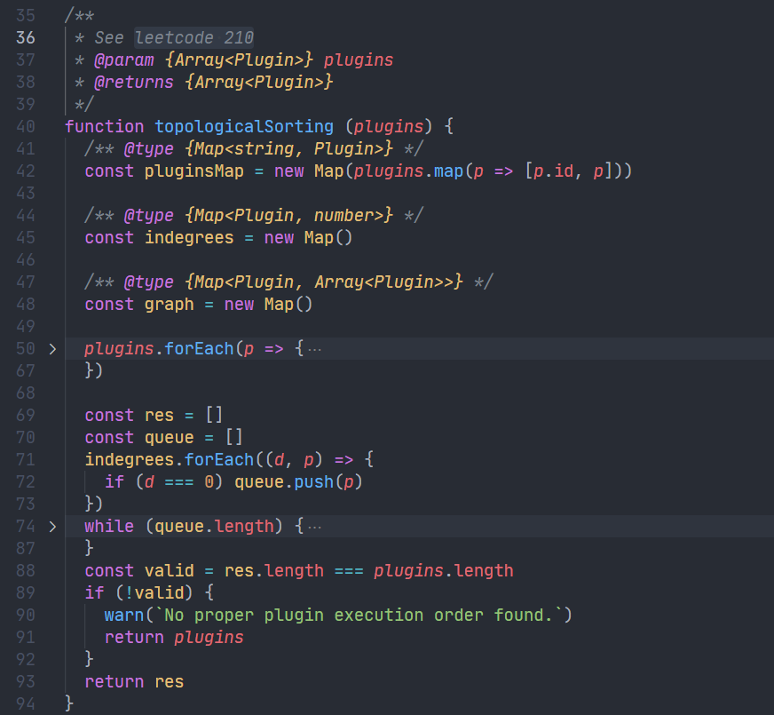
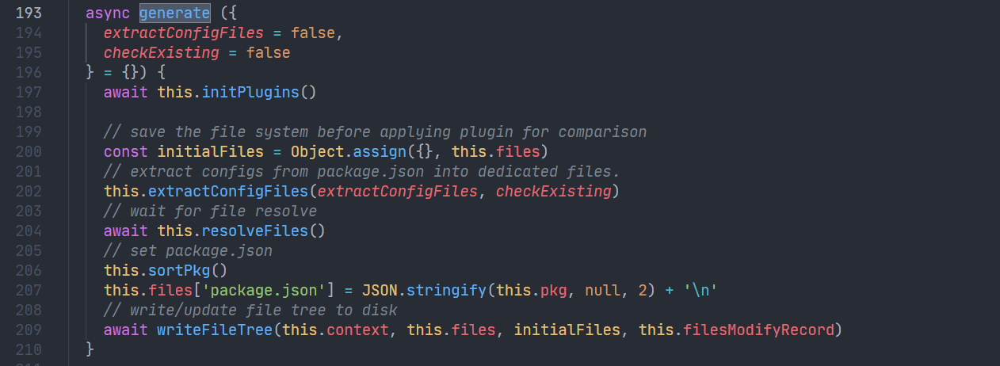
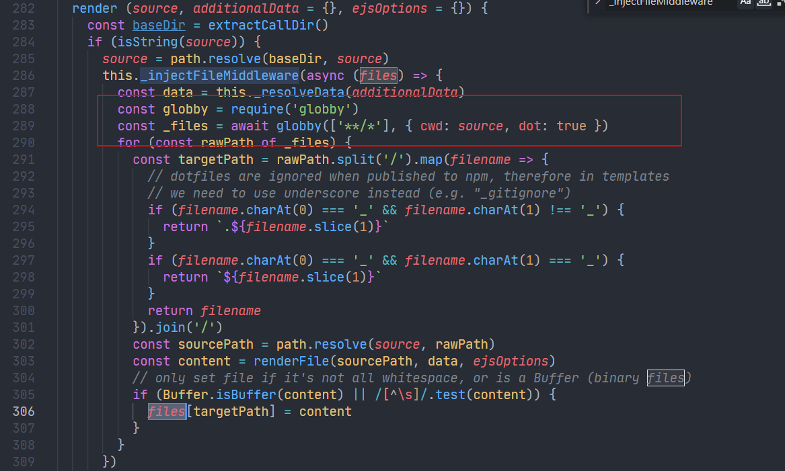
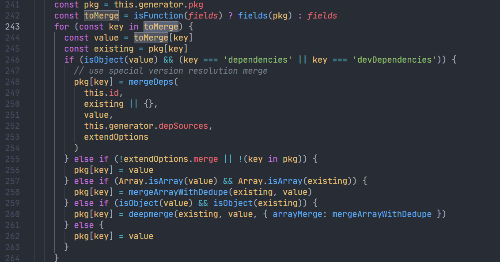
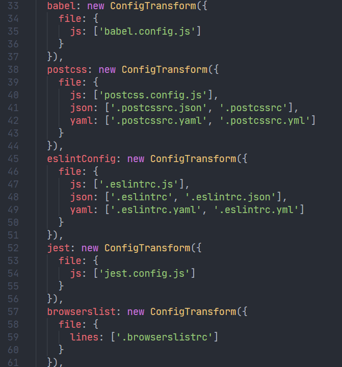

上文说到创建完`package.json`文件并安装`plugins`的依赖，然后后续会初始化`Generator`实例，`Generator`内部会调用各个`plugin`，涉及到插件机制的实现，这里单独起一篇介绍。

<!--truncate-->

## plugin程序

首先了解一下`@vue/cli`中`plugin`的开发方式，`plugin`由一个 Service 插件`index.js`文件作为引导，此外还可以包含`generator.js `，`prompts.js`这些文件。

`index.js`可以修改 webpack 配置，创建新的 vue-cli service 命令或者修改已经存在的命令。

`generator`主要用于拓展项目依赖，创建新的文件或者编辑已经存在的文件；且必须是一个函数。

`prompts.js`则在创建一个新的项目或者在已有项目中添加新的插件时处理用户选项，通过`inquirer`实现。

```shell
.
├── README.md
├── generator.js  # generator（可选）
├── index.js      # service 插件
├── package.json
├── prompts.js    # prompt 文件（可选）
└── ui.js         # Vue UI 集成（可选）
```

## 加载plugin

紧接上文继续分析`Creator`内部的`create`方法，在安装完`@vue/cli`内部的`vue-cli-service`等插件的依赖后，会通过`resolvePlugins`方法对`preset`的`plugins`执行顺序进行排列，保证`vue-cli-service`始终第一个执行，并且加载`plugin`内部的`generator.js`和`prompts.js`程序，推入`apply`方法。


## 初始化Generator

加载完`plugin`之后，会初始化`Generator`实例。


### plugins排序

在`Generator`构造函数内部会对`plugins`进行排序，这个排序有点讲究的，根据代码里的注释来看使用了 leetcode 210 题的算法，这里以后探索。




### 加载generator程序

初始化的时候还会加载`package.json`内部的其他插件，放入实例的`allPlugins`内部。


## 调用generate方法

初始化完`Generator`会调用实例的`generate`方法，`generate`内部首先会调用`initPlugins`



`initPlugins`内部会为每一个`plugin`初始化一个`GeneratorAPI`的实例，然后将实例对象传入`apply`方法，上文说到`apply`就是`plugin`内部的`generator`程序，所以这里就是执行`plugin`内部的`generator`。


## GeneratorAPI

`GeneratorAPI`这个类内部包含编写`plugin`的`generator`所需要的所有方法，其在初始化的时候接收`plugin`的名称`id`，`Generator`的实例，插件的参数`options`。其内部定义了生成模板文件的方法`render`，拓展`package.json`的依赖项`extendPackage`等。

### vue-cli-service

以`vue-cli-service`为例，其内部`generator`程序如下，使用`render`方法渲染`template`内部的模板文件，拓展`package.json`的依赖项以及注入`scripts`和`browserslist`字段。


### render

`render`方法会解析传入的文件夹路径，使用`globby`匹配获取文件夹下的所有文件。对于`ejs`模板还会调用`renderFile`方法将参数填入模板内部。



最后通过`_injectFileMiddleware`推入`Generator`实例的`fileMiddlewares`中。


###extendPackage



`extendPackage`内部会拓展`Generator`实例的`pkg`属性，也就对应`package.json`内部的字段。

## 生成配置文件

继续看`generate`方法，之后会调用`extractConfigFiles`方法，`extractConfigFiles`会获取在`package.json`内部的配置项字段，例如`babel`，`eslintConfig`，`browserslist`等，将它们对应的有效配置文件名称推入实例的`files`属性内部，然后删除`package.json`内部的这些字段。



之后会调用`writeFileTree`生成所有文件，`writeFileTree`内部使用`fs-extra`来操作文件。这样`plugin`的`generator`就执行完了。


